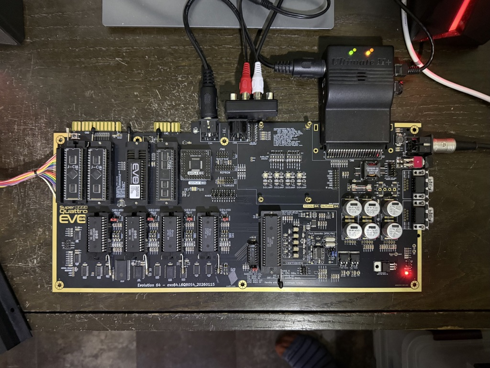

# EVO64 Super Quattro - Quad SID Player

**The first-ever fully playable 4-SID music track for the Commodore 64!**

This project creates a simultaneous quad-SID music player for the [EVO64 Super Quattro](https://evo64.com) — a modern hardware reimagining of the Commodore 64 that supports up to four SID audio chips, delivering 12 voices of polyphonic chiptune goodness.


*The EVO64 Super Quattro board with four SID chip sockets, dual CIAs, onboard audio amps, and the custom QAPLA PLA — ready for 12-voice polyphonic playback.*

## Overview

Four independent SID tunes play simultaneously, each driving a separate SID chip:

| Tune | SID Address | Voices | Memory Location |
|------|------------|--------|----------------|
| 1    | `$D400`    | 3      | `$1000-$1FD5`  |
| 2    | `$D420`    | 3      | `$3000-$3FDC`  |
| 3    | `$D440`    | 3      | `$5000-$5F17`  |
| 4    | `$D460`    | 3      | `$7000-$8224`  |

Playback is driven by a raster interrupt chain that divides the PAL video frame (312 raster lines) into four equal segments, triggering each tune's play routine in sequence every ~78 lines.

## Music

All four tunes are by **László Vincze (Vincenzo)** of **Singular Crew** (2017), created with **SID-WIZARD 1.7**. The tunes are configured for the **MOS 8580** SID chip at **PAL** timing (50Hz VBI).

## How It Works

### The Challenge

No one had ever made a single playable 4-SID track before. The C64 normally has one SID chip at address `$D400`. The EVO64 Super Quattro maps four SIDs at `$D400`, `$D420`, `$D440`, and `$D460`.

Standard SID tunes are compiled with hardcoded absolute addresses baked throughout their code and data — both references to their own load address (`$1000`) and to the SID register base (`$D400`). All four of our source tunes are compiled identically at `$1000` targeting `$D400`. To play them simultaneously, each must be relocated to its own memory region and retargeted to a different SID chip, without corrupting the music.

### The Solution: Three-Layer Patching

The key insight is that a SID-WIZARD binary contains three distinct categories of data that reference addresses, each requiring a different patching strategy:

#### Layer 1 — Code Relocation (329 patches per tune)

A **recursive descent disassembler** traces execution from known entry points (init, play, and the jump table) to map every reachable instruction. This cleanly separates code (~45% of each binary) from data (~55%). Within confirmed code, every absolute address operand (`ABS`, `ABX`, `ABY`, `IND` modes) that falls within the tune's original address range is adjusted by the relocation delta. SID register references (`$D400-$D41F`) are redirected to the target SID chip address.

#### Layer 2 — Split Hi-Byte Tables (PPTRHI, INSPTHI)

SID-WIZARD stores pattern and instrument pointers as **paired lo/hi byte tables** — one contiguous array of low bytes followed by a separate contiguous array of high bytes. These are identified through **code flow analysis**: the disassembler finds every `LDA abs,Y` / `LDA abs,X` instruction that accesses the data region, then traces up to 3 subsequent instructions to determine where the loaded value is stored. Values stored to an **odd zero-page address** (e.g., `$FF`) indicate the high byte of a 16-bit pointer pair, confirming the source table as a hi-byte address table. Table sizes are inferred from the gap between matched lo/hi table pairs.

#### Layer 3 — Interleaved Pointer Tables (BIGFXTABLE, SUBTUNES)

SID-WIZARD also has tables with **interleaved 16-bit little-endian address pairs** — alternating lo/hi bytes. These are detected by finding pairs of ABX/ABY table accesses whose base addresses differ by exactly 1 byte (`LDA table,Y` and `LDA table+1,Y`). This pattern is characteristic of the BIGFXTABLE (31 jump addresses to effects routines) and the SUBTUNES table (sequence pointers for each voice). Within each detected interleaved region, every byte pair forming a valid address in the tune's range has its hi-byte adjusted.

### How the Architecture Was Decoded

The patching strategy was informed by studying the **SID-WIZARD 1.94 native source code**, specifically the `exporter.asm` relocator. SID-WIZARD's own `relodata` function patches exactly four data table types during relocation: PPTRHI (pattern pointer hi-bytes), INSPTHI (instrument pointer hi-bytes), BIGFXTABLE (interleaved FX jump addresses), and SUBTUNES (interleaved sequence pointers). Our tool replicates this behavior through code analysis rather than requiring access to the relocation tables (which are not included in exported SID files).

### The Raster Interrupt Chain

The 6510 assembly harness (`QuadSID_Player.asm`) initializes all four tunes and configures a circular VIC-II raster interrupt chain. With BASIC and KERNAL ROMs banked out (`$01 = $35`), the hardware IRQ vector at `$FFFE/$FFFF` is written directly. Each IRQ handler plays one tune, sets the next raster trigger line and handler address, then returns — creating a stable four-way round-robin at 50Hz per tune.

## Building

### Prerequisites

- **Python 3** (for the SID processor tool)
- **Java** (for KickAssembler) — install via `brew install openjdk`
- **KickAssembler** (included in `KickAssembler/KickAss.jar`)

### Build Commands

```bash
# Full build (process SIDs + compile assembly)
./build.sh

# Build and launch in VICE emulator
./build.sh run

# Only process SID files (no compilation)
./build.sh process

# Clean build artifacts
./build.sh clean
```

### Output

The build produces `build/QuadSID_Player.prg` (~31KB), ready to load on a real C64 or in an emulator.

## Testing in VICE

VICE 3.10 supports up to 8 SID chips. Launch with quad-SID configuration:

```bash
x64sc -sidextra 3 \
  -sid2address 0xD420 \
  -sid3address 0xD440 \
  -sid4address 0xD460 \
  build/QuadSID_Player.prg
```

Or use the included launcher script:

```bash
./vice-quad-sid-play.sh
```

## Running on Real Hardware

Load the `.prg` file onto the EVO64 Super Quattro via SD2IEC, Ultimate II+, or other storage device. The board must have four SID chips installed with the QAPLA PLA configured for the `$D400`/`$D420`/`$D440`/`$D460` addressing scheme.

## Project Structure

```
quad-sid-player/
├── src/
│   └── QuadSID_Player.asm      # 6510 assembly: IRQ chain + title screen
├── tools/
│   └── sid_processor.py         # Python: SID parsing, disassembly, relocation
├── QuadCore-SIDs/               # Source SID music files (4 tunes)
├── build/                       # Generated artifacts (tune binaries, .prg)
├── KickAssembler/               # KickAssembler cross-assembler (KickAss.jar)
├── docs/                        # SID format specs, VICE documentation
├── assets/                      # Project images
├── build.sh                     # Build orchestration script
├── vice-quad-sid-play.sh        # VICE launcher with quad-SID flags
└── README.md
```

## Technical Details

### Memory Map

```
$0801-$080C  BASIC SYS startup stub
$0810-$0CCB  Main program (IRQ harness + title screen)
$1000-$1FD5  Tune 1 (original location, SID @ $D400)
$3000-$3FDC  Tune 2 (relocated +$2000, SID @ $D420)
$5000-$5F17  Tune 3 (relocated +$4000, SID @ $D440)
$7000-$8224  Tune 4 (relocated +$6000, SID @ $D460)
```

### SID-WIZARD Player Binary Structure

Each exported SID file contains an identical player engine with tune-specific music data appended:

```
$1000-$100B  Jump table (JMP init, JMP play, ...)
$100C-$109F  Tune header (title, author, metadata)
$10A0-$1A19  Player code (1845 bytes, 822 instructions)
$1A1A-end    Music data (patterns, instruments, pointer tables)
```

The recursive descent disassembler identified **329 absolute address references** within the player code — all requiring relocation. The player uses **self-modifying code** extensively: data table addresses are written into instruction operands at runtime, which is why static disassembly from entry points is essential for accurate code/data separation.

### Data Table Patching Summary

| Table Type | Detection Method | Patch Strategy | Typical Count |
|-----------|-----------------|---------------|--------------|
| PPTRHI (pattern ptr hi) | Flow analysis → odd ZP store | Every byte | 10-37 per tune |
| INSPTHI (instrument ptr hi) | Flow analysis → odd ZP store | Every byte | 10-37 per tune |
| BIGFXTABLE (FX jump addrs) | Adjacent ABX/ABY bases | Hi-byte of each 16-bit pair | 31 per tune |
| SUBTUNES (sequence ptrs) | Adjacent ABX/ABY bases | Hi-byte of each 16-bit pair | 3 per tune |

### SID Register Patch Map

Each tune has 16 SID register references that are retargeted:

```
Voice 1: $D400-$D406 → $D4x0-$D4x6  (frequency, pulse width, control, ADSR)
Filter:  $D415-$D418 → $D4x5-$D4x8  (cutoff, resonance, mode/volume)
```

Where `x` = `0` (SID 1), `2` (SID 2), `4` (SID 3), `6` (SID 4).

## The EVO64 Super Quattro

The EVO64 is a hardware reimagining of the Commodore 64 that brings together decades of community modifications:

- Support for 4 SID chips with flexible address selection
- ClearVideo64 enhanced video circuit
- Switchable PAL/NTSC clock
- SRAM main memory (eliminates VSP bug)
- Custom QAPLA PLA for multi-SID, multi-ROM support
- Optional vacuum tube audio preamps
- Full backwards compatibility with original C64 software

## Credits

- **Hardware**: EVO64 Super Quattro by the EVO64 Project
- **Music**: László Vincze (Vincenzo) / Singular Crew, 2017
- **Player Engine**: SID-WIZARD 1.7
- **Quad SID Player & Tooling**: EVO64 Project, 2026

## License

This project is for educational and demonstration purposes as part of the EVO64 project.
