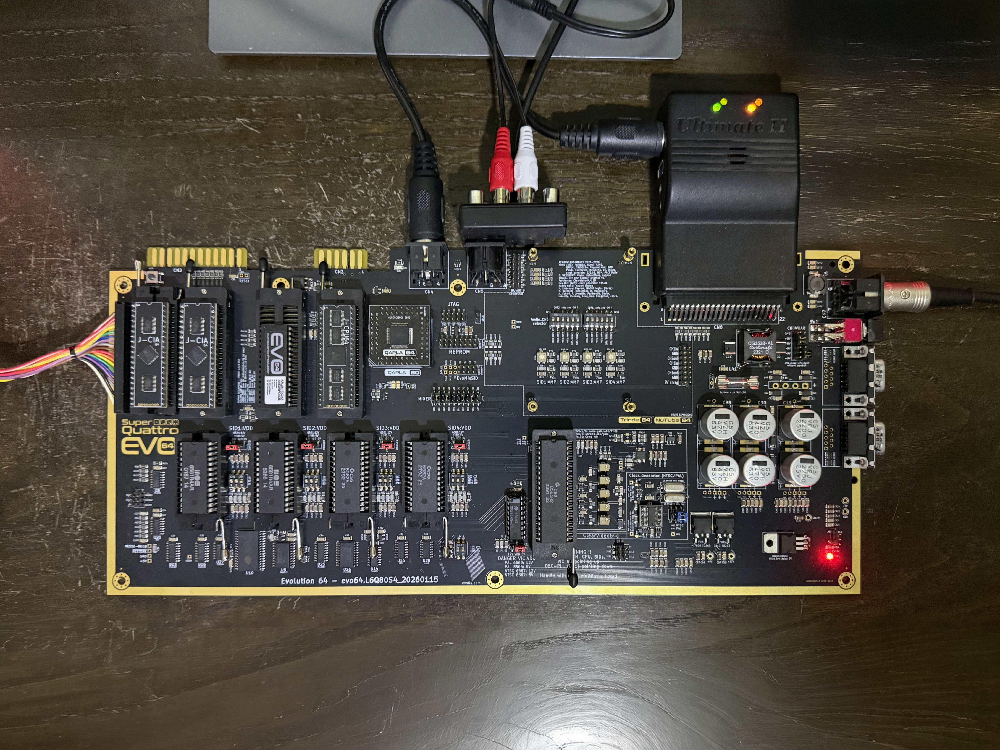
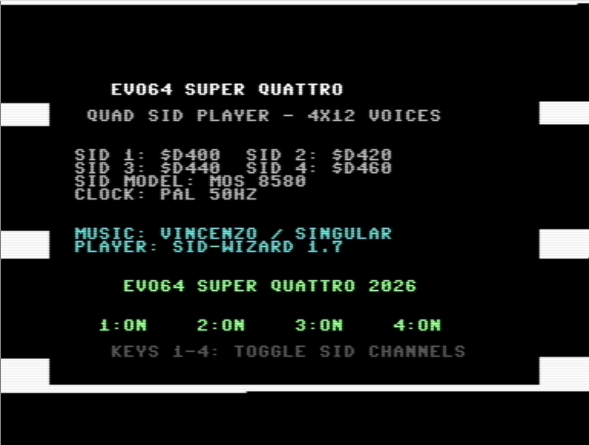

# EVO64 Super Quattro - Quad SID Player

**The first-ever fully playable 4-SID music track for the Commodore 64!**

This project creates a simultaneous quad-SID music player for the [EVO64 Super Quattro](https://evo64.com) — a modern hardware reimagining of the Commodore 64 that supports up to four SID audio chips, delivering 12 voices of polyphonic chiptune goodness.


*The EVO64 Super Quattro board with four SID chip sockets, dual CIAs, onboard audio amps, and the custom QAPLA PLA — ready for 12-voice polyphonic playback.*

## Overview

Four independent SID tunes play simultaneously, each driving a separate SID chip:

| Tune | SID Address | Voices | Memory Location |
|------|------------|--------|----------------|
| 1    | `$D400`    | 3      | `$1000-$1FD5`  |
| 2    | `$D420`    | 3      | `$3000-$3FDC`  |
| 3    | `$D440`    | 3      | `$5000-$5F17`  |
| 4    | `$D460`    | 3      | `$7000-$8224`  |

Playback is driven by a raster interrupt chain that divides the PAL video frame (312 raster lines) into four equal segments, triggering each tune's play routine in sequence every ~78 lines.

## Music


All four tunes are by **László Vincze (Vincenzo)** of **Singular Crew** (2017), created with **SID-WIZARD 1.7**. The tunes are configured for the **MOS 8580** SID chip at **PAL** timing (50Hz VBI).

## How It Works

### The Challenge

I couldn't find a single playable 4-SID track demo, so I combined four different single-SID players, by relocating thier player code and their music data. 

Standard SID tunes are compiled with hardcoded absolute addresses baked throughout their code and data — both references to their own load address (`$1000`) and to the SID register base (`$D400`). All four of our source tunes are compiled identically at `$1000` targeting `$D400`. To play them simultaneously, each must be relocated to its own memory region and retargeted to a different SID chip, without corrupting the music.

### The Solution: Three-Layer Patching

The key insight is that a SID-WIZARD binary contains three distinct categories of data that reference addresses, each requiring a different patching strategy:

#### Layer 1 — Code Relocation (329 patches per tune)

A **recursive descent disassembler** traces execution from known entry points (init, play, and the jump table) to map every reachable instruction. This cleanly separates code (~45% of each binary) from data (~55%). Within confirmed code, every absolute address operand (`ABS`, `ABX`, `ABY`, `IND` modes) that falls within the tune's original address range is adjusted by the relocation delta. SID register references (`$D400-$D41F`) are redirected to the target SID chip address.

#### Layer 2 — Split Hi-Byte Tables (PPTRHI, INSPTHI)

SID-WIZARD stores pattern and instrument pointers as **paired lo/hi byte tables** — one contiguous array of low bytes followed by a separate contiguous array of high bytes. These are identified through **code flow analysis**: the disassembler finds every `LDA abs,Y` / `LDA abs,X` instruction that accesses the data region, then traces up to 3 subsequent instructions to determine where the loaded value is stored. Values stored to an **odd zero-page address** (e.g., `$FF`) indicate the high byte of a 16-bit pointer pair, confirming the source table as a hi-byte address table. Table sizes are inferred from the gap between matched lo/hi table pairs.

#### Layer 3 — Interleaved Pointer Tables (BIGFXTABLE, SUBTUNES)

SID-WIZARD also has tables with **interleaved 16-bit little-endian address pairs** — alternating lo/hi bytes. These are detected by finding pairs of ABX/ABY table accesses whose base addresses differ by exactly 1 byte (`LDA table,Y` and `LDA table+1,Y`). This pattern is characteristic of the BIGFXTABLE (31 jump addresses to effects routines) and the SUBTUNES table (sequence pointers for each voice). Within each detected interleaved region, every byte pair forming a valid address in the tune's range has its hi-byte adjusted.

### How the Architecture Was Decoded

The patching strategy was informed by studying the **SID-WIZARD 1.94 native source code**, specifically the `exporter.asm` relocator. SID-WIZARD's own `relodata` function patches exactly four data table types during relocation: PPTRHI (pattern pointer hi-bytes), INSPTHI (instrument pointer hi-bytes), BIGFXTABLE (interleaved FX jump addresses), and SUBTUNES (interleaved sequence pointers). Our tool replicates this behavior through code analysis rather than requiring access to the relocation tables (which are not included in exported SID files).

### The Raster Interrupt Chain

The 6510 assembly harness (`QuadSID_Player.asm`) initializes all four tunes and configures a circular VIC-II raster interrupt chain. With BASIC and KERNAL ROMs banked out (`$01 = $35`), the hardware IRQ vector at `$FFFE/$FFFF` is written directly. Each IRQ handler plays one tune, sets the next raster trigger line and handler address, then returns — creating a stable four-way round-robin at 50Hz per tune.

For a detailed guide on analyzing and integrating different types of 4-SID files (PSID, RSID, single-SID collections, native multi-SID), see **[Integrating 4-SID Tunes](docs/Integrating-4SID-tunes.txt)**.

## Building

### Prerequisites

- **Python 3** (for the SID processor tool)
- **Java** (for KickAssembler) — install via `brew install openjdk`
- **KickAssembler** (included in `KickAssembler/KickAss.jar`)
- **Exomizer** (optional, for PRG compression) — install via `brew install exomizer`

### Build Commands

```bash
# Build a specific demo
./build.sh quadcore       # QuadCore (Vincenzo)
./build.sh megachase      # Mega Chase (SHAD0WFAX)
./build.sh hermit         # 4SID Example (HERMIT)
./build.sh siggraph       # Siggraph Invitro (Narciso)
./build.sh teenspirit     # Teen Spirit (John Ames)
./build.sh hammer         # A-D Hammer (Rayden)
./build.sh mon            # A-D Mon (Rayden)
./build.sh twice          # A-D Twice (Rayden)

# Build all demos
./build.sh all

# Build and launch in VICE emulator
./build.sh quadcore run
./build.sh hammer run
# ... etc.

# Clean build artifacts
./build.sh clean

# List available demos
./build.sh list
```

### Output

Each demo produces an uncompressed PRG, an [Exomizer](https://bitbucket.org/magli143/exomizer/wiki/Home)-compressed PRG (self-decrunching, ~60-77% smaller), and is added to a shared D64 disk image:

```
build/EVO64-SuperQuattro.d64           # D64 floppy image with all demos
build/QuadSID_Player_exo.prg           # QuadCore        (~7KB from ~31KB)
build/MegaChase_Player_exo.prg         # Mega Chase       (~6KB from ~13KB)
build/Hermit4SID_Player_exo.prg        # 4SID Example     (~5KB from ~11KB)
build/SiggraphInvitro_Player_exo.prg   # Siggraph Invitro (~3KB from  ~7KB)
build/TeenSpirit_Player_exo.prg        # Teen Spirit       (~4KB from ~29KB)
build/Rayden_Hammer_Player_exo.prg     # A-D Hammer        (~7KB from ~18KB)
build/Rayden_Mon_Player_exo.prg        # A-D Mon           (~7KB from ~14KB)
build/Rayden_Twice_Player_exo.prg      # A-D Twice         (~7KB from ~17KB)
```

The compressed versions load and run identically to the uncompressed versions — just `LOAD` and `RUN`. If Exomizer is not installed, the build skips compression automatically.

## Testing in VICE

VICE 3.10 supports up to 8 SID chips. Use the included launcher:

```bash
./vice-quad-sid-play.sh quadcore
./vice-quad-sid-play.sh megachase
./vice-quad-sid-play.sh hermit
./vice-quad-sid-play.sh siggraph
./vice-quad-sid-play.sh teenspirit
./vice-quad-sid-play.sh hammer
./vice-quad-sid-play.sh mon
./vice-quad-sid-play.sh twice
```

Or launch manually:

```bash
x64sc -sidextra 3 \
  -sid2address 0xD420 \
  -sid3address 0xD440 \
  -sid4address 0xD460 \
  build/QuadSID_Player_exo.prg
```

## Running on Real Hardware

Copy the D64 disk image or individual `.prg` files onto the EVO64 Super Quattro via SD2IEC, Ultimate II+, or other storage device. The board must have four SID chips installed with the QAPLA PLA configured for the `$D400`/`$D420`/`$D440`/`$D460` addressing scheme.

## Demos

### QuadCore (Vincenzo / Singular Crew, 2017)

Four separate single-SID tunes playing simultaneously via a raster interrupt chain. Each tune was originally composed for a single SID and is relocated + patched by `sid_processor.py` to target a different SID chip address.

### Mega Chase Theme (SHAD0WFAX, 2025)

A native 4-SID composition exported from SID-WIZARD 1.9 using the PSID v4E format. The single binary already contains code targeting all four SID chips with stereo channel mapping (SIDs 1+3 left, SIDs 2+4 right).

### 4SID Example-Tune (HERMIT, 2022)

A native 4-SID composition by Mihály Horváth (HERMIT), the creator of SID-WIZARD. Also uses the PSID v4E format with stereo channel mapping. A showcase of the SID-WIZARD 1.9 multi-SID capabilities.

### Siggraph Invitro 4SID (Narciso / Onslaught, 2023)

A native 4-SID composition exported from SID-WIZARD 1.9 using the PSID v4E format. Like Mega Chase and HERMIT, a single play call drives all four SID chips. The tune binary spans into the BASIC ROM shadow at `$A000`, requiring early ROM banking before init — a gotcha [documented in our integration guide](docs/Integrating-4SID-tunes.txt).

### Smells Like Teen Spirit (John Ames / AmesSoft, 2003)

A four-part cover of Nirvana's classic arranged across four separate SID files — main guitar, 2nd guitar, bass & drums, and melody. Like QuadCore, the four tunes are relocated and patched by `sid_processor.py` to target different memory addresses and SID chips. Originally composed for MOS 6581 at NTSC timing.

### A-D Hammer / Mon / Twice (Rayden / Alpha Flight, 1998)

Three native 4-SID compositions by Patrick Zeh (Rayden), packaged as RSID v4E files. Unlike the PSID tunes above, these contain **four independent player instances** inside a single binary, each pre-configured for its own SID chip (`$D400`, `$D420`, `$D440`, `$D460`). The original RSID wrapper uses a busy-wait loop; our harness bypasses it and calls each sub-tune's init/play directly from a raster IRQ. No relocation or SID patching is needed. See [Integrating 4-SID Tunes](docs/Integrating-4SID-tunes.txt) for details on the different integration categories.

## Project Structure

```
quad-sid-player/
├── src/
│   ├── QuadSID_Player.asm          # QuadCore: 4-way raster IRQ chain
│   ├── MegaChase_Player.asm        # Mega Chase: single-call native 4-SID
│   ├── Hermit4SID_Player.asm       # 4SID Example: single-call native 4-SID
│   ├── SiggraphInvitro_Player.asm  # Siggraph Invitro: single-call native 4-SID
│   ├── TeenSpirit_Player.asm       # Teen Spirit: 4-way raster IRQ chain
│   ├── Rayden_Hammer_Player.asm    # A-D Hammer: 4 sub-tune RSID harness
│   ├── Rayden_Mon_Player.asm       # A-D Mon: 4 sub-tune RSID harness
│   └── Rayden_Twice_Player.asm     # A-D Twice: 4 sub-tune RSID harness
├── tools/
│   ├── sid_processor.py             # SID parsing, disassembly, relocation
│   └── multisid-tester.prg          # SID address tester utility (C64)
├── sids/
│   ├── quadcore/                    # 4 separate single-SID tunes (.sid)
│   ├── megachase/                   # Native 4-SID PSID v4E (.sid)
│   ├── hermit-4sid-example/         # Native 4-SID PSID v4E (.sid)
│   ├── siggraph-invitro/            # Native 4-SID PSID v4E (.sid)
│   ├── smells-like-team-spirit/     # 4 separate single-SID tunes (.sid)
│   ├── rayden-hammer/               # Native 4-SID RSID v4E (.sid)
│   ├── rayden-mon/                  # Native 4-SID RSID v4E (.sid)
│   └── rayden-twice/                # Native 4-SID RSID v4E (.sid)
├── build/                           # Generated artifacts (.prg, .d64)
├── KickAssembler/                   # KickAssembler cross-assembler
├── docs/
│   ├── Integrating-4SID-tunes.txt   # Integration guide & category reference
│   ├── SID-file-format.txt          # HVSC SID format specification
│   └── Exotic-SID-formats.txt       # PSID v4E extended header format
├── assets/                          # Project images
├── build.sh                         # Unified build script
├── vice-quad-sid-play.sh            # VICE launcher with quad-SID flags
└── README.md
```

## Technical Details

### Memory Map

```
$0801-$080C  BASIC SYS startup stub
$0810-$0CCB  Main program (IRQ harness + title screen)
$1000-$1FD5  Tune 1 (original location, SID @ $D400)
$3000-$3FDC  Tune 2 (relocated +$2000, SID @ $D420)
$5000-$5F17  Tune 3 (relocated +$4000, SID @ $D440)
$7000-$8224  Tune 4 (relocated +$6000, SID @ $D460)
```

### SID-WIZARD Player Binary Structure

Each exported SID file contains an identical player engine with tune-specific music data appended:

```
$1000-$100B  Jump table (JMP init, JMP play, ...)
$100C-$109F  Tune header (title, author, metadata)
$10A0-$1A19  Player code (1845 bytes, 822 instructions)
$1A1A-end    Music data (patterns, instruments, pointer tables)
```

The recursive descent disassembler identified **329 absolute address references** within the player code — all requiring relocation. The player uses **self-modifying code** extensively: data table addresses are written into instruction operands at runtime, which is why static disassembly from entry points is essential for accurate code/data separation.

### Data Table Patching Summary

| Table Type | Detection Method | Patch Strategy | Typical Count |
|-----------|-----------------|---------------|--------------|
| PPTRHI (pattern ptr hi) | Flow analysis → odd ZP store | Every byte | 10-37 per tune |
| INSPTHI (instrument ptr hi) | Flow analysis → odd ZP store | Every byte | 10-37 per tune |
| BIGFXTABLE (FX jump addrs) | Adjacent ABX/ABY bases | Hi-byte of each 16-bit pair | 31 per tune |
| SUBTUNES (sequence ptrs) | Adjacent ABX/ABY bases | Hi-byte of each 16-bit pair | 3 per tune |

### SID Register Patch Map

Each tune has 16 SID register references that are retargeted:

```
Voice 1: $D400-$D406 → $D4x0-$D4x6  (frequency, pulse width, control, ADSR)
Filter:  $D415-$D418 → $D4x5-$D4x8  (cutoff, resonance, mode/volume)
```

Where `x` = `0` (SID 1), `2` (SID 2), `4` (SID 3), `6` (SID 4).

## The EVO64 Super Quattro

The EVO64 is a hardware reimagining of the Commodore 64 that brings together decades of community modifications:

- Support for 4 SID chips with flexible address selection
- ClearVideo64 enhanced video circuit
- Switchable PAL/NTSC clock
- SRAM main memory (eliminates VSP bug)
- Custom QAPLA PLA for multi-SID, multi-ROM support
- Optional vacuum tube audio preamps
- Full backwards compatibility with original C64 software

## Credits

- **Hardware**: EVO64 Super Quattro by Auroscience
- **Music**: László Vincze (Vincenzo) / Singular Crew, 2017; SHAD0WFAX, 2025; HERMIT (Mihály Horváth), 2022; Narciso / Onslaught, 2023; John Ames / AmesSoft, 2003; Patrick Zeh (Rayden) / Alpha Flight, 1998
- **Player Engines**: SID-WIZARD 1.7 / 1.9; DMC 4SID
- **Compression**: [Exomizer](https://bitbucket.org/magli143/exomizer/wiki/Home) by Magnus Lind
- **Quad SID Player & Tooling**: EVO64 Project, 2026

## License

This project is for educational and demonstration purposes as part of the EVO64 project.
